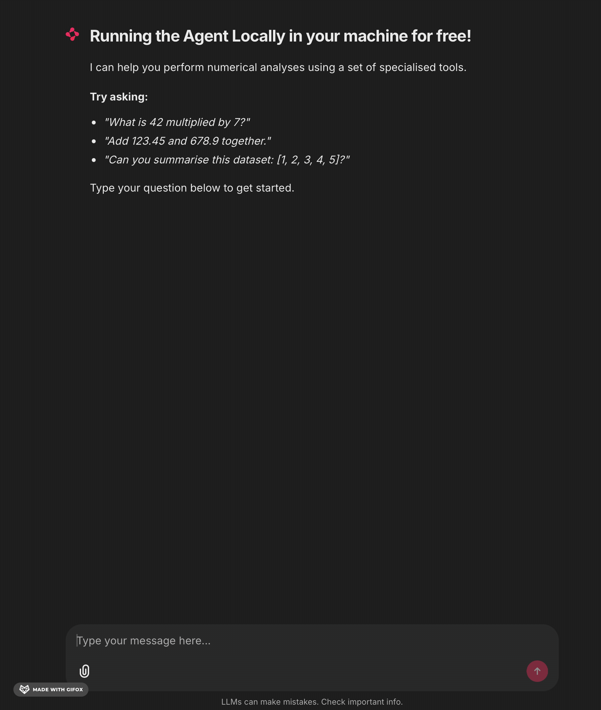
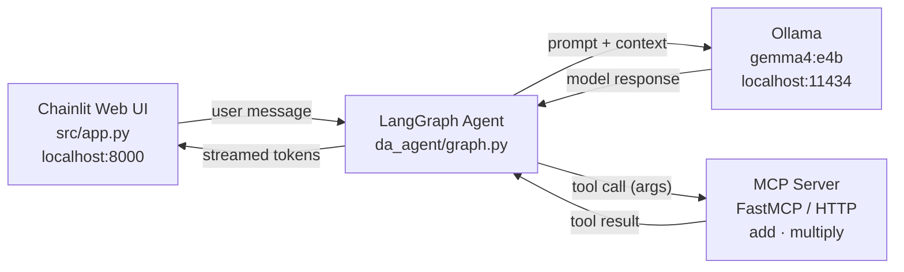

# Local LLM — Free AI Agents with Gemma 4 + Ollama + Chainlit

> Build and chat with a fully local AI agent — no API keys, no cloud costs, everything runs on your own machine.

[](https://www.python.org/)
[](LICENSE)
[](https://github.com/astral-sh/uv)

---

## Overview

This project demonstrates how to build a production-style AI agent that runs entirely offline using open-weight models. It combines a LangGraph reasoning loop, MCP-based tool serving, and a Chainlit web UI into a clean, modular architecture.



---

**Stack**

| Component | Role |
|---|---|
| [Ollama](https://ollama.com/) | Serves the LLM locally via an OpenAI-compatible HTTP API |
| [Gemma 4 e4b](https://ai.google.dev/gemma/docs/core) | 4-bit quantised model (~2 GB), runs on laptop GPU or CPU |
| [LangGraph](https://github.com/langchain-ai/langgraph) | Agent reasoning loop with persistent memory and checkpointing |
| [FastMCP](https://github.com/jlowin/fastmcp) | Exposes Python functions as MCP tools over HTTP |
| [langchain-mcp-adapters](https://github.com/langchain-ai/langchain-mcp-adapters) | Discovers and wraps MCP tools for use in LangChain agents |
| [Chainlit](https://chainlit.io/) | Streaming chat web UI with per-session thread management |

---

## Architecture



Each browser session gets its own `thread_id` — conversation memory is scoped per session via LangGraph's `MemorySaver` checkpointer.

---

## Prerequisites

| Requirement | Version / Notes |
|---|---|
| Python | ≥ 3.12 |
| [uv](https://github.com/astral-sh/uv) | Recommended package manager |
| [Ollama](https://ollama.com/download) | Must be running (`ollama serve`) |
| Gemma 4 e4b | Pull with `ollama pull gemma4:e4b` |

---

## Quick Start

**1. Clone**

```bash
git clone https://github.com/ai-with-ali/local-llm.git
cd local-llm
```

**2. Install dependencies**

```bash
uv sync
```

**3. Configure environment**

```bash
cp .env.example .env
```

`.env.example`:

```env
OLLAMA_SERVER_URL=http://localhost:11434
MCP_DataAnalysis_Host=localhost
MCP_DataAnalysis_Port=8000
```

**4. Start Ollama**

```bash
ollama serve
ollama pull gemma4:e4b   # first run only
```

---

## Running

Two processes must run simultaneously.

**Terminal 1 — MCP tool server**

```bash
uv run python -m src.mcp.server.math.server
```

**Terminal 2 — Chainlit web UI**

```bash
uv run chainlit run src/app.py --port 8000
```

Open [http://localhost:8000](http://localhost:8000) in your browser. Each session maintains its own conversation history.

> **VS Code users:** use the **Run & Debug** panel. Select *"Debug MCP Math Server"* or *"Run Chainlit App"* from the dropdown and press F5.

---

## Project Structure

```
.
├── src/
│   ├── app.py                        # Chainlit UI — session lifecycle and message streaming
│   ├── agents/
│   │   └── da_agent/
│   │       └── graph.py              # LangGraph agent (Ollama + tools + MemorySaver)
│   └── mcp/
│       ├── client/
│       │   └── master_mcp_client.py  # MultiServerMCPClient — tool discovery
│       └── server/
│           └── math/
│               └── server.py         # FastMCP server — add() and multiply() tools
├── pyproject.toml                    # Project metadata and dependencies
├── .env.example                      # Environment variable template
└── chainlit.md                       # Chainlit welcome screen
```

---

## How It Works

1. **User sends a message** via the Chainlit UI.
2. **`on_message`** wraps it in a `HumanMessage` and calls `agent.astream_events()`.
3. **LangGraph** routes the message through the agent graph. If a tool is needed, it emits `on_tool_start` / `on_tool_end` events — shown as collapsible steps in the UI.
4. **The MCP server** executes the tool (e.g. `add(5, 7)`) and returns the result.
5. **LLM tokens** are streamed back in real time via `on_chat_model_stream` events.
6. **The final answer** is sent to the UI once streaming completes.

---

## Key Design Decisions

**Why MCP for tools?**
MCP standardises tool discovery and invocation. Adding a new tool means writing a plain Python function decorated with `@mcp.tool()` — no manual JSON schema, no agent redeployment.

**Why per-session agent instances?**
Each `on_chat_start` creates a fresh agent with its own `MemorySaver` and `thread_id`. This gives complete session isolation without a shared database.

**Why `astream_events` instead of `ainvoke`?**
`astream_events(version="v2")` surfaces granular lifecycle events — tool calls appear as they happen, and LLM tokens stream in real time, giving users immediate feedback rather than waiting for a full response.

---

## Contributing

1. Fork the repository
2. Create a feature branch: `git checkout -b feat/your-feature`
3. Commit using [Conventional Commits](https://www.conventionalcommits.org/)
4. Open a pull request against `master`
